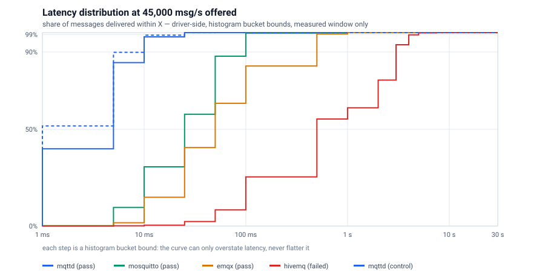
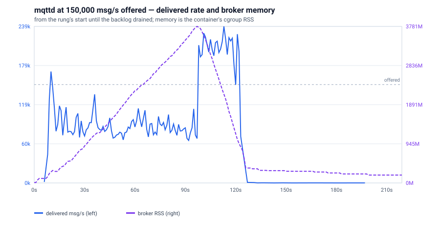

# mqttd — a security-first, cluster-native MQTT broker

[](https://github.com/mbilling/fss-mqtt-broker/actions/workflows/ci.yml)
[](https://github.com/mbilling/fss-mqtt-broker/releases)
[](LICENSE)
[](https://github.com/mbilling/fss-mqtt-broker/pkgs/container/fss-mqtt-broker)
[](https://scorecard.dev/viewer/?uri=github.com/mbilling/fss-mqtt-broker)
[](https://www.bestpractices.dev/projects/14161)

> **Open == Enterprise: every feature, no paid tier.**
>
> MQTT 3.1.1 + 5.0 · Rust · durable sessions quorum-replicated **by default** · Apache-2.0, everything.
>
> **75,000 msg/s** on one 4-vCPU node at p99 ≤ 1 s — **1.7× Mosquitto and EMQX, 2.5× HiveMQ CE**, same host, EMQX's own load tool. [Numbers ↓](#by-the-numbers)

---

## Why mqttd

| | mqttd | the others |
|---|---|---|
| **Single-node throughput** | 75k msg/s at p99 ≤ 1 s, 30% CPU idle | 45k / 45k / 30k (Mosquitto / EMQX / HiveMQ CE) |
| **Durable sessions** | quorum-replicated, **default**; acked QoS 1/2 survives node loss, even in flight | Mosquitto/NanoMQ single-node · VerneMQ loses queues on node death · EMQX opt-in |
| **Revocation** | policy reload **evicts live sessions** | not documented by any compared broker |
| **Secure by default** | TLS 1.3, mTLS/OIDC, deny-by-default ACL, hash-chained audit; insecure = opt-in + `INSECURE:` log | varies; NanoMQ and Mosquitto < 2.0 allow anonymous by default |
| **Clustering** | free, Apache-2.0, signed reproducible builds | EMQX 💰 BSL · VerneMQ 💰 EULA binaries · HiveMQ CE single-node |
| **Checkable claims** | every capability → task → evidence ([dashboard](docs/delivery/STATUS.md)); losing cells printed | — |

---

## By the numbers

Sources: [SINGLE-NODE-COMPARISON.md](docs/benchmarks/SINGLE-NODE-COMPARISON.md) (2026-09-16, one Hetzner CCX23, 4 vCPU / 16 GB, brokers in sequence, untuned) · [SCALE-CURVE.md](docs/benchmarks/SCALE-CURVE.md) (one host + NVMe per broker).

**Single-node knee** — highest rate at p99 ≤ 1 s and ≥ 99% delivered (1:1 QoS 0, 200 B):

```text
mqttd      1.0.17   ██████████████████████████████████████████████████  75,000 msg/s
Mosquitto  2.0.20   ██████████████████████████████                      45,000
EMQX       5.8.6    ██████████████████████████████                      45,000
HiveMQ CE  2024.3   ████████████████████                                30,000
```

| broker | knee | p99 at knee | CPU idle | RSS | what limits it |
|---|---|---|---|---|---|
| **mqttd** | **75,000** | ≤ 500 ms | **30%** | 133 MiB | tail latency |
| Mosquitto | 45,000 | ≤ 100 ms | 70% | **18 MiB** | single thread (1 of 4 cores) |
| EMQX | 45,000 | ≤ 500 ms | 2% | 434 MiB | CPU |
| HiveMQ CE | 30,000 | ≤ 100 ms | 5% | 927 MiB | JVM heap → OOM crash |

**Latency distribution at 45,000 msg/s** (Mosquitto's and EMQX's knee) — share delivered within:

| | 1 ms | 10 ms | 25 ms | 100 ms | 1 s |
|---|---|---|---|---|---|
| **mqttd** | **39.9%** | **97.8%** | **100%** | 100% | 100% |
| Mosquitto | 0.1% | 30.6% | 57.8% | 99.7% | 100% |
| EMQX | 0.1% | 14.9% | 40.6% | 82.8% | 100% |
| HiveMQ CE | 0.0% | 0.4% | 2.3% | 25.4% | 61.1% |



**Overload at 150,000 msg/s:**

| | mqttd | Mosquitto | EMQX | HiveMQ CE |
|---|---|---|---|---|
| behaviour | queues, drains at **239k msg/s** (1.6× offer) | sheds, 38% of offer | queues | JVM dies |
| peak memory | 3.8 GiB | 991 MiB | 3.6 GiB | 12 GiB |
| memory returned | **95%** | **98%** | 24% | — |



**Cluster scale-out, durable QoS 1** (ack after fsync + quorum):

```text
1 node  ████████████████████░░░░░░░░░░░░░   8.5k msg/s   p99 90 ms
3 nodes ████████████████████░░░░░░░░░░░░░   8.6k         p99 82 ms   quorum tax absorbed
5 nodes █████████████████████████████████  13.9k         p99 56 ms   1.63× one node
```

**Cluster scale-out, QoS 1 shared subscriptions** (clean sessions, at-least-once
both ways — no durable session, so this is the routing path, not the fsync one):

```text
3 nodes ██████████████████████░░░░░░░░░░░  120k msg/s   25.9 MB/s   p99 ≤ 5 ms   40.0k/node
5 nodes █████████████████████████████████  180k         38.9 MB/s   p99 ≤ 5 ms   36.0k/node
```

MB/s is application payload (216 B/message). **The constraint is packets, not
bytes** — measured: holding 60,000 msg/s and growing the payload to 8 KiB reached
**492 MB/s** (1,576 Mbit/s per node) while softirq stayed flat at 24–34% across
the whole 38× increase. So **small messages are the expensive case** — size a
cluster on messages per second, not megabytes. 492 MB/s is a floor; nothing was
saturated there.

Three repetitions plus a passing control at each size, delivery matching offer to
within 2 msg/s, 144M message identities reconciled with zero lost. **These are
what the rig carried, and the rig ran out first**: one core of each broker host
saturates on *network interrupt handling* (54.6% softirq, 1.2% idle, while its
three siblings sit 33–39% idle), and mqttd's own hub loop was at **0.46 of a
core** — roughly 2× headroom — measured by the broker's own dispatch metric
rather than by sampling CPU. Spreading that softirq is a settled dead end for capacity
(#505/#507: +1.9%, noise); the cause is **cross-node forwarding**, which is why
`shared_prefer_local` is the default (#508/#511, +42% at N=5). Full method, the
per-core breakdown, and two earlier revisions of this claim that were wrong:
[QOS1-SCALE-CURVE.md](docs/benchmarks/QOS1-SCALE-CURVE.md).

| more published points | |
|---|---|
| `$share` fan-out floor, 1 → 3 → 5 nodes | ~18.6k → ~53.9k → ~81.4k msg/s (driver-limited) |
| 50,000 idle connections | 19.3–19.7 KiB each, flat across cluster sizes |
| durable QoS 1 vs clean session, same publish | ~28 ms vs ~0.03 ms p50 (dev host) |
| codec, 256 B PUBLISH | encode ~270 ns · decode ~190 ns · per-PR regression gate |

**Where mqttd loses:**
- Mosquitto: **7× less memory** at its knee; tighter tail (≤ 100 ms) at its own knee, as does HiveMQ
- EMQX: quietest at 15k msg/s (≤ 1 ms p99; mqttd matches)
- 3 nodes ≈ 1 node on the durable path
- **No production users yet**
- full list: [GUIDE.md § Limitations](GUIDE.md#limitations)

---

## Quick Start (60 seconds)

```sh
docker run -d --name mqttd -p 1883:1883 \
  -e MQTTD_PLAINTEXT_BIND=0.0.0.0:1883 -e MQTTD_ALLOW_ANONYMOUS=1 \
  -e MQTTD_DATA_DIR=/var/lib/mqttd -v mqttd-data:/var/lib/mqttd \
  ghcr.io/mbilling/fss-mqtt-broker:latest

mosquitto_sub -h 127.0.0.1 -p 1883 -t 'sensors/+/temp' &
mosquitto_pub -h 127.0.0.1 -p 1883 -t 'sensors/kitchen/temp' -m '21.5C'
```

Plaintext + anonymous: a first look, never a deployment. Secured version (TLS 1.3 + mTLS + ACL, CI-tested): [GUIDE](GUIDE.md#single-node-secured-tls-13--mtls--acl). Windows: [GUIDE](GUIDE.md#try-it-in-two-minutes).

---

## Features

| Protocol | |
|---|---|
| Versions | MQTT 3.1.1 + 5.0, full semantics; CI-conformant against Mosquitto CLI + Paho |
| QoS | 0 / 1 / 2; QoS 2 handshake resumes under the same packet id across a crash |
| Retained | durable, single-owner, consensus-ordered — no wall-clock in correctness |
| Shared subscriptions | `$share/<group>/<filter>`, **cluster-wide** |
| MQTT 5 | session/message expiry, topic aliases, flow control, user properties, subscription ids, request/response, enhanced `AUTH`, reason codes |
| Transports | TCP · TLS 1.3 · WebSocket (ws/wss) · **QUIC** (multi-stream) |

| Security | |
|---|---|
| TLS | 1.3 default (rustls / aws-lc-rs); hardened 1.2 opt-in; fleet-sized resumption cache |
| Identity | mTLS (CN/SAN, CRL) · Argon2id passwords · JWT · **OIDC** with JWKS rotation · fail-closed HTTP auth hook |
| Authorization | deny-by-default TOML ACL, `%i` / `%c` substitution, `0x87` on denied v5 publish |
| Session binding | a session cannot be resumed by a different principal |
| Hot reload | `SIGHUP` / file watch; validate-before-swap; **sweeps live sessions, grants, peer links** |
| Cluster | mTLS bus, one cert per node; signed, replay-protected gossip |
| Audit | hash-chained, SIEM schema, offline verifier |
| Code | Rust, `#![forbid(unsafe_code)]`, every parser fuzzed |

| Scale & HA | |
|---|---|
| Mesh | masterless; SWIM membership; auto mTLS peer links; interest-based routing; HRW placement |
| Durability | openraft lease group + epoch-fenced quorum replication + on-disk redb — **default** |
| Resize | grow / shrink (`SIGUSR1` drain) / replace with zero acked loss, verified under SIGKILL + partition |
| Partition | CP: minority serves committed state, retained writes queue until heal |
| Upgrades | adjacent-release skew (N ↔ N+1), nightly-tested both directions |
| Backup | online per-node export/restore, window measured |

| Operations | |
|---|---|
| Metrics | Prometheus `GET /metrics` + OTLP push; bounded labels |
| Health | `/livez` · `/readyz` · `/statusz` · `mqttd --probe` |
| Governance | connection caps (global, per-IP), auth penalty box, quotas, rate limit by backpressure, retained cap, disk/memory watermarks → brownout (refuse, never silent-drop) |
| Admin | signals + files + `--check-config`; **no HTTP API or dashboard, by design** |
| Packaging | Helm chart · Kubernetes operator (`MqttdCluster` CRD) · Compose · hardened systemd |

| Integrations | |
|---|---|
| Bridge | `mqtt-bridge`: separate signed binary/image, deny-by-default directional rules, loop prevention, bounded spool, HA pairs |
| Kafka / webhook / DB | `$share` consumer group on durable sessions ([INTEGRATION.md](docs/INTEGRATION.md)); no rule engine, by design |
| Migration | converters for Mosquitto, EMQX, HiveMQ configs + ACLs → reviewed draft ([MIGRATION.md](docs/MIGRATION.md)) |
| Plugins | HTTP auth hook; `Authenticator` / `Authorizer` traits; no dynamic loader |

---

## Open == Enterprise

- **One build.** Clustering, quorum durability, mTLS/OIDC, live eviction, audit chain, metrics, Helm, operator, bridge, FIPS variant — all in it.
- **License:** [Apache-2.0](LICENSE), binaries and images included. Commercial use, modification, embedding, redistribution: yes.
- **Paid, ever:** support, SLAs, certified builds. **Never features.**
- **Procurement:** [SUPPORT.md](SUPPORT.md) · [compliance/](docs/compliance/) (EU CRA, IEC 62443, SOC 2 / ISO 27001) · SBOM + [VEX](security/vex/) + SLSA per release.

---

## Benchmarks

Rules ([ADR 0048](docs/adr/0048-comparative-benchmarking.md)): pinned versions · disclosed hardware and config · dated · losing cells printed · control arm or the run is void.

### Single-node comparison — method

| | |
|---|---|
| Record | [SINGLE-NODE-COMPARISON.md](docs/benchmarks/SINGLE-NODE-COMPARISON.md), dated 2026-09-17 |
| Host | Hetzner CCX23 (4 dedicated vCPU, EPYC-Milan, 16 GB); 3 × CCX43 (16 vCPU) drivers |
| Versions | mqttd 1.0.17 (published image) · Mosquitto 2.0.20 · EMQX 5.8.6 · HiveMQ CE 2024.3 — digests + config SHA-256 per arm |
| Tool | emqtt-bench 0.6.3 (EMQX's); driver-side measurement only |
| Workload | 1:1 QoS 0, 200 B, 25 msg/s per publisher; ladder 15k → 150k msg/s; 60 s per rung |
| Rung passes | ≥ 99% delivered · ≥ 95% of offer · p99 ≤ 1 s · settled · drained |
| Config | documented minimum per broker, [committed verbatim](bench/scale/compare/); **nobody tuned**; HiveMQ heap = ½ host RAM |
| Posture | plaintext, anonymous, in-memory; **mqttd durable OFF** (`MQTTD_DURABLE_SESSIONS=0`), disclosed |
| Control | mqttd run first and last → same knee, 0.1% drift; > 5% would void the run |
| Second run | 2026-09-17, fresh fleet: mqttd 75k knee and HiveMQ heap death reproduced |
| Latency | histogram bucket upper bounds ("p99 ≤ X") — coarse, cannot flatter |
| Cost | ~€5, ~2.5 h |

```sh
cd bench/scale && export HCLOUD_TOKEN=…
COMPARE_BROKERS="mqttd mosquitto emqx hivemq" \
COMPARE_RATES="15000 30000 45000 60000 75000 90000 120000 150000" \
BROKER_TYPE=ccx23 DRIVER_TYPE=ccx43 DRIVER_COUNT=3 ./run.sh compare
python3 summarize-compare.py .runs/<stamp>/results
```

More charts: [latency 30k](docs/benchmarks/img/latency-30000.svg) · [latency 75k](docs/benchmarks/img/latency-75000.svg) · overload [Mosquitto](docs/benchmarks/img/timeline-mosquitto-150k.svg) · [EMQX](docs/benchmarks/img/timeline-emqx-150k.svg) · [HiveMQ](docs/benchmarks/img/timeline-hivemq-150k.svg)

### Scaling curve — method

| | |
|---|---|
| Record | [SCALE-CURVE.md](docs/benchmarks/SCALE-CURVE.md), verified against `v1.0.5` (2026-08-24) |
| Hosts | one CCX23 + local NVMe per broker; CCX33 drivers; fresh cluster per size |
| Build | released, cosign-signed, byte-reproducible binary; shipped systemd unit |
| Lanes | durable QoS 1 / QoS 2 (`durable_bench`, exact ack RTTs) · `$share` fan-out (emqtt-bench) · 50k idle connections |
| Workload | 256 B; 48 publishers × window 8; 60 s windows; median of 3 |
| Self-check | per-host disk barrier floor gates the durable curve; driver-limited rungs excluded; counter mismatches flagged |
| Cost | `./run.sh smoke` < €0.50 / 20 min; full 1+3+5 a few euros |

| durable QoS 1 | 1 node | 3 nodes | 5 nodes |
|---|---|---|---|
| acked msg/s | 8,503 | 8,647 | **13,893** |
| p99 saturating | 90 ms | 82 ms | **56 ms** |
| p99 uncontended | 1.01 ms | 1.81 ms | 1.69 ms |
| × disk barrier rate | 3.9× | 4.4× | 7.2× |
| QoS 2 msg/s | 2,970 | 2,124 | 3,009 |
| clean sessions msg/s | 32.1k | 89.4k | 109.6k |

Other published measurements (dev-grade, single host, never capacity): [DURABLE-PATH.md](docs/benchmarks/DURABLE-PATH.md) · [BASELINE.md](docs/benchmarks/BASELINE.md) · [BACKUP-RESTORE.md](docs/benchmarks/BACKUP-RESTORE.md).

### Where competitors win

| dimension | winner | detail |
|---|---|---|
| Memory at knee | Mosquitto | 18 MiB vs 133 MiB (7×); 4 MiB at 15k |
| Tail at own knee | Mosquitto, HiveMQ CE | ≤ 100 ms vs mqttd ≤ 500 ms |
| Quiet at low load | EMQX (mqttd matches) | ≤ 1 ms p99 at 15k |
| Footprint | NanoMQ, Mosquitto | ~4.6 MB image / few-MB daemon vs ~14 MB |
| Track record | all of them | mqttd: **no production users** |
| Hard memory cap | Mosquitto | mqttd: watermark + brownout only |
| Feature surface | EMQX | dashboard, SQL rules, MQTT-SN/CoAP |
| Linear scale-out | nobody yet | 3 ≈ 1 node durable; plan [#537](https://github.com/mbilling/fss-mqtt-broker/issues/537) |
| Not covered | — | one instance type, QoS 0, plaintext, no TLS, no cluster; newer Mosquitto 2.1 / EMQX 6.x unmeasured |

---

## Feature Comparison Matrix

✅ open build · 💰 **paid edition only** · ⚠️ partial · ✖ absent · n/v not verified. Sources and notes: [COMPARISON.md](docs/COMPARISON.md) (dated 2026-08-19).

| Feature | mqttd | Mosquitto 2.x | EMQX 6.x | HiveMQ CE | VerneMQ 2.1 | NanoMQ 0.25 |
|---|---|---|---|---|---|---|
| MQTT 3.1.1 + 5.0 | ✅ | ✅ | ✅ | ✅ | ✅ | ✅ |
| QoS 0/1/2, retained, LWT | ✅ | ✅ | ✅ | ✅ | ✅ | ✅ |
| Shared subscriptions | ✅ cluster-wide | ✅ node | ✅ | ✅ node | ⚠️ | ⚠️ |
| WebSocket | ✅ | ✅ | ✅ | ✅ | ✅ | ✅ |
| QUIC | ✅ | ✖ | ✅ | ✖ | ✖ | ⚠️ |
| TLS 1.3 default | ✅ | ⚠️ | ⚠️ | n/v | ⚠️ | ⚠️ |
| mTLS | ✅ | ✅ | ✅ | ✅ | ✅ | ✅ |
| OIDC / JWT built in | ✅ | ✖ | ✅ | 💰 | ✖ | ✖ |
| Reload evicts live sessions | ✅ | ⚠️ | n/v | n/v | ⚠️ | ⚠️ |
| Tamper-evident audit | ✅ | ✖ | n/v | n/v | ✖ | ✖ |
| **Clustering** | ✅ | ✖ | 💰 BSL | 💰 | ✅ (💰 binaries) | ✖ |
| **Replicated sessions** | ✅ default | n/a | ⚠️ opt-in | 💰 | ✖ | ✖ |
| Acked msg survives node loss | ✅ proven | n/a | n/v | 💰 | ✖ | ✖ |
| Data-safe resize | ✅ | n/a | n/v | 💰 | ⚠️ | n/a |
| Prometheus | ✅ + OTLP | `$SYS` | ✅ | 💰 | ✅ | ✅ |
| Helm + operator | ✅ | ✖ | ✅ | 💰 | ⚠️ | ⚠️ |
| Online backup/restore | ✅ | ⚠️ | n/v | 💰 | n/v | n/v |
| Bridge | ✅ | ✅ | ✅ | ✖ | ✅ | ✅ |
| Rule engine | ✖ by design | ✖ | ✅ | ✖ | ✖ | ✅ |
| Dashboard / admin API | ✖ by design | ✖ | ✅ | 💰 | ✅ | ✅ |
| MQTT-SN / CoAP | ✖ | ✖ | ✅ | ✖ | ✖ | ✖ |
| Signed reproducible builds + SBOM | ✅ | ✖ | n/v | n/v | ✖ | ✖ |
| FIPS variant | ✅ | ✖ | n/v | 💰 | ✖ | ✖ |
| Memory-safe | ✅ Rust | C | Erlang | Java | Erlang | C |
| **License** | **Apache-2.0** | EPL/EDL | BSL 1.1 | Apache-2.0 | Apache src / EULA bin | MIT |

---

## Installation

Current release **v1.0.17** · static musl `linux/amd64` + `linux/arm64` · cosign-signed · SLSA · CycloneDX SBOM · verify: [RELEASING.md](RELEASING.md).

**Docker**
```sh
docker run -d --name mqttd --read-only --cap-drop ALL --security-opt no-new-privileges \
  -v mqttd-data:/var/lib/mqttd -v "$PWD/pki":/etc/mqttd/tls:ro -v "$PWD/acl.toml":/etc/mqttd/acl.toml:ro \
  -p 8883:8883 -p 8080:8080 \
  -e MQTTD_TLS_BIND=0.0.0.0:8883 -e MQTTD_TLS_CERT=/etc/mqttd/tls/server.crt -e MQTTD_TLS_KEY=/etc/mqttd/tls/server.key \
  -e MQTTD_ACL_FILE=/etc/mqttd/acl.toml -e MQTTD_DATA_DIR=/var/lib/mqttd -e MQTTD_HEALTH_BIND=0.0.0.0:8080 \
  ghcr.io/mbilling/fss-mqtt-broker:1.0.17
cosign verify ghcr.io/mbilling/fss-mqtt-broker:1.0.17 \
  --certificate-identity-regexp 'https://github.com/mbilling/fss-mqtt-broker/.github/workflows/release.yml@.*' \
  --certificate-oidc-issuer https://token.actions.githubusercontent.com
```

**Kubernetes**
```sh
NS=mqttd REPLICAS=3 ./deploy/helm/mqttd/bootstrap.sh
helm install mqttd deploy/helm/mqttd -n mqttd --set replicaCount=3 \
  --set secrets.tls.secretName=mqttd-tls --set secrets.peerTls.secretName=mqttd-peer-tls \
  --set secrets.gossipKey.secretName=mqttd-gossip
```
Operator: `deploy/helm/mqttd-operator` · guide: [KUBERNETES.md](docs/KUBERNETES.md)

**Compose / systemd**
```sh
cd deploy/compose && ./bootstrap.sh && docker compose up -d    # 3 TLS nodes, one host
```
Bare metal: [`deploy/systemd/`](deploy/systemd/) · tutorial: [SECURED-CLUSTER-TUTORIAL.md](docs/SECURED-CLUSTER-TUTORIAL.md)

**Binaries:** [GitHub Releases](https://github.com/mbilling/fss-mqtt-broker/releases) (`mqttd-*`, `mqttd-fips-*`, `mqtt-bridge-*`)

**Source** (Rust ≥ 1.88)
```sh
git clone https://github.com/mbilling/fss-mqtt-broker && cd fss-mqtt-broker
cargo build --release --bin mqttd
cargo install --locked --path tools/mqttui    # runnable map of every demo/test/migration script
```

---

## Configuration

Layering: **defaults < TOML < `MQTTD_*` env < CLI** · strict schema · secrets by path · hot reload.

```toml
[node]
id = "node-1"
data_dir = "/var/lib/mqttd"

[listeners]
tls_bind    = "0.0.0.0:8883"
health_bind = "0.0.0.0:8080"      # /livez /readyz /metrics

[tls]
cert      = "/etc/mqttd/tls/server.crt"
key       = "/etc/mqttd/tls/server.key"
client_ca = "/etc/mqttd/tls/client-ca.crt"   # mTLS

[security]
allow_anonymous = false
acl_file = "/etc/mqttd/acl.toml"             # deny by default
```

```sh
mqttd --check-config --config mqttd.toml    # validate, binds nothing
kill -HUP "$(pidof mqttd)"                  # reload policy, TLS, quotas
```

Template: [`docs/mqttd.example.toml`](docs/mqttd.example.toml) · every key: [CONFIGURATION.md](docs/CONFIGURATION.md)

---

## Production Deployment

**Sizing** — [SIZING.md](docs/SIZING.md), preset [`bounded-node.toml`](docs/examples/bounded-node.toml). Nine knobs bound a node:

| knob | ships as |
|---|---|
| `MQTTD_DATA_DIR` | required (durable on) |
| `MQTTD_STORE_MAX_BYTES` | unbounded |
| `MQTTD_MAX_CONNECTIONS` (+`_PER_IP`) | uncapped |
| `MQTTD_MAX_PACKET_SIZE` | 1 MiB |
| `MQTTD_MAX_SESSIONS` | uncapped |
| `MQTTD_MAX_QUEUED_MESSAGES` | 100,000 / drop-oldest |
| `MQTTD_MAX_BACKLOG_*`, `MQTTD_MAX_INFLIGHT_MESSAGES` | 10,000 / off / 65,535 |
| `MQTTD_MAX_RETAINED_MESSAGES` | uncapped |
| `MQTTD_AUTH_PENALTY_THRESHOLD` | unlimited attempts |

Memory watermark at 75–85% of the container limit; the container limit is the hard bound. ~19 KiB per idle connection.

**Clustering**
- **≥ 3 nodes, never 2** (2-node write quorum is 2-of-2: worse than 1)
- one founder boots with an empty seed list; others seed off any member
- one cluster-bus certificate **per node**
- grow: start a node · shrink: `SIGUSR1` · replace: grow then shrink · upgrade: one node at a time
- day 2: [OPERATIONS.md](docs/OPERATIONS.md)

**Hardening** — 34-item baseline with auditor checks: [HARDENING.md](docs/HARDENING.md)
- [ ] no `INSECURE:` lines in the startup log
- [ ] `MQTTD_DATA_DIR` on a volume
- [ ] no plaintext listener; TLS 1.3; client certs carry `clientAuth` EKU
- [ ] anonymous off; Argon2id passwords via `mqttd --hash-password`; file mode ≤ 640
- [ ] ACL file, `default = "deny"`
- [ ] caps and watermarks set
- [ ] per-node bus certs; gossip key from file
- [ ] CRL configured, reload tested
- [ ] `--read-only --cap-drop ALL --security-opt no-new-privileges`, or the shipped systemd unit

---

## Monitoring & Observability

| | |
|---|---|
| Metrics | Prometheus `GET /metrics` · OTLP push (`MQTTD_OTLP_ENDPOINT`) · bounded labels |
| Probes | `/livez` · `/readyz` (members, lease, decommission) · `/statusz` · `mqttd --probe` |
| Audit | hash-chained JSON; schema + verifier: [AUDIT-SCHEMA.md](docs/AUDIT-SCHEMA.md) |
| Dashboards | Grafana for broker + bridge: [`deploy/observability/`](deploy/observability/); alert runbooks: [OPERATIONS.md](docs/OPERATIONS.md) |
| Demo | `cd demo && docker compose up --build` → cluster + Grafana + Prometheus + Alloy at `localhost:3000` |

---

## Architecture

```text
        MQTT clients  (TCP · TLS 1.3 · WebSocket · QUIC)
              │  identity: mTLS-CN / password / JWT / OIDC
              ▼        ↓ deny-by-default topic ACL
       ┌──────────────────────────────────────────┐
       │  node                                    │
       │   listeners → per-connection tasks       │
       │                    ▼                     │
       │            hub (routing actor)           │   one hub per node;
       │        subscriptions · retained · queues │   no lock on the hot path
       └────────────────────┼─────────────────────┘
   ┌────────────────────────┼────────────────────────┐
   │ SWIM gossip            │ peer links (mTLS)      │  one trust domain =
   │ membership, interest   │ interest-based forward │  one logical broker
   └────────────────────────┼────────────────────────┘
                            ▼
              durable plane — openraft lease group
              epoch-fenced quorum replication
```

- shared-nothing nodes; one routing actor per node; cross-node traffic is just another command
- durable write **before** the wire send → "acked" means "replicated"; clean sessions and QoS 0 skip it
- consensus for control (epochs, ownership), small replica sets for data
- refuse at the edge: reason code or backpressure, never a silent drop
- bridge is a separate process and failure domain
- decisions: [`docs/adr/`](docs/adr/) (77 ADRs, per-task status) · tour: [ARCHITECTURE.md](docs/ARCHITECTURE.md) · [THREAT-MODEL.md](docs/THREAT-MODEL.md)

**Workspace layout**

| crate | owns |
|---|---|
| `mqtt-codec` | MQTT 3.1.1 + 5.0 wire codec; fuzzed |
| `mqtt-core` | sessions, subscription tables, topic matching, ACL relations |
| `mqtt-net` | listeners (TCP/TLS/WebSocket/QUIC), the one audited TLS module |
| `mqtt-auth` | `Authenticator` / `Authorizer` traits; mTLS-CN, Argon2id, JWT, OIDC, ACL |
| `mqtt-storage` | `SessionStore` / `RetainedStore`, replicated log, redb |
| `mqtt-cluster` | SWIM, gossip auth, HRW placement, peer wire, durable plane |
| `mqtt-observability` | Prometheus/OTLP metrics, hash-chained audit |
| `mqtt-config` | typed config, secure defaults |
| `mqtt-bridge` | zone-crossing bridge: spool, QoS 1 replay |
| `mqttd` | the broker binary: hub, connections, peer mesh |
| `mqttd-operator` | Kubernetes operator for `MqttdCluster` |
| `history-check` | independent checker of recorded client-visible histories |

---

## Documentation

Index: [docs/README.md](docs/README.md)

| goal | doc |
|---|---|
| Everything, long form | [GUIDE.md](GUIDE.md) — walkthroughs, Limitations, resizing, upgrades, hot reload |
| Evaluate | [EVALUATION.md](docs/EVALUATION.md) · [COMPARISON.md](docs/COMPARISON.md) |
| Deploy | [SECURED-CLUSTER-TUTORIAL.md](docs/SECURED-CLUSTER-TUTORIAL.md) · [KUBERNETES.md](docs/KUBERNETES.md) |
| Build clients | [CLIENT-GUIDE.md](docs/CLIENT-GUIDE.md) |
| Operate | [OPERATIONS.md](docs/OPERATIONS.md) · [SIZING.md](docs/SIZING.md) · [TROUBLESHOOTING.md](docs/TROUBLESHOOTING.md) |
| Audit | [THREAT-MODEL.md](docs/THREAT-MODEL.md) · [HARDENING.md](docs/HARDENING.md) · [compliance/](docs/compliance/) |
| Migrate | [MIGRATION.md](docs/MIGRATION.md) |
| Decisions | [adr/](docs/adr/) · [delivery dashboard](docs/delivery/STATUS.md) |
| Terms | [GLOSSARY.md](docs/GLOSSARY.md) |

---

## Roadmap

Tracked on the [delivery dashboard](docs/delivery/STATUS.md).

- **Benchmarks:** multi-host cluster comparison ([#244](https://github.com/mbilling/fss-mqtt-broker/issues/244)), larger hosts, TLS posture, per-release re-run ([#545](https://github.com/mbilling/fss-mqtt-broker/issues/545))
- **Scale-out:** measure then optimise ([#537](https://github.com/mbilling/fss-mqtt-broker/issues/537)); durable ownership beyond the voter set (ADR 0073); workload arms incl. burst (ADR 0077); QoS 0 shared-worker capacity ([#482](https://github.com/mbilling/fss-mqtt-broker/issues/482))
- **Auth:** SCRAM · OCSP · PSK suites · server-initiated re-auth
- **Migration:** NanoMQ converter ([#546](https://github.com/mbilling/fss-mqtt-broker/issues/546)); bridge demo ([#547](https://github.com/mbilling/fss-mqtt-broker/issues/547))
- **Security:** OSS-Fuzz ([#553](https://github.com/mbilling/fss-mqtt-broker/issues/553)); funded third-party audit ([#554](https://github.com/mbilling/fss-mqtt-broker/issues/554))
- **Routing:** bloom subscription digests; MQTT 5 Server-Reference redirect
- **Operator:** CRD promotion from `v1alpha1`
- **Not planned, by decision:** dashboard, HTTP admin API, SQL rule engine, MQTT-SN/CoAP

---

## Security Policy

- **Report privately:** <https://github.com/mbilling/fss-mqtt-broker/security/advisories/new> — never a public issue
- Policy, scope, timelines: [SECURITY.md](SECURITY.md)
- Per-release CVE dispositions: [security/vex/](security/vex/)
- Supported lines: [SUPPORT.md](SUPPORT.md) (three most recent minors)

---

## Support & Community

- **Issues:** [GitHub Issues](https://github.com/mbilling/fss-mqtt-broker/issues) — the only channel today; no chat or forum yet
- **Releases:** [GitHub Releases](https://github.com/mbilling/fss-mqtt-broker/releases)
- **Lifecycle:** three minor lines patched; adjacent-release upgrades ([SUPPORT.md](SUPPORT.md))
- **Commercial:** model = support, SLAs, certified builds; nothing published yet — open an issue
- **Status:** `v1.0.17` released and signed; **no production users yet**

---

## Contributing

[CONTRIBUTING.md](CONTRIBUTING.md) · [Code of Conduct](CODE_OF_CONDUCT.md)

- decisions live in ADRs, progress in delivery docs
- a task title is a claim, and the claim must be true
- prose must not actively mislead

```sh
cargo build && cargo test && cargo clippy --all-targets && cargo deny check
./scripts/interop/run.sh     # foreign-client conformance
mqttui --list                # There are 91 runnable scripts here: demos, smokes, migrations, benches
```

---

## License

[Apache-2.0](LICENSE). Every crate, binary and image. No paid tier, no feature gates.
