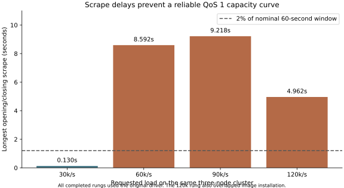

# QoS 1 harness confirmation — 18 September 2026

The harness now checks aligned measurement windows and exact shared-group delivery identities. The one authorized three-node cloud run **did not qualify a capacity point**. It verified delivery accounting across 81,454,240 messages, exposed multi-second measurement stalls, and then aborted when a driver became unreachable over SSH. All cloud resources were destroyed; the Hetzner API independently returned zero servers afterward.

The largest obstacle to a credible scaling claim is still establishing that the offered load and measurement system remain reliable. These observations do not identify a broker capacity limit. Do not publish the higher-load latency/throughput figures as validated capacity measurements.

## What the run established

Run: `confirm-20260918T162211Z`. Three CCX23 brokers, five CCX33 drivers; FSS 1.0.17; MQTT5 QoS1 publish/subscription; clean sessions; shared consumers; 3,000 publishers and 10 consumers per site; 10 publishes/s per publisher. Each site's publishers and subscribers shared one driver. Payload: 200 application bytes plus 16 timestamp/sequence bytes, versus 208 total bytes in the legacy timestamp-only runs.

| Requested rate | Completed sent = PUBACKed = uniquely received | Missing / duplicates / unacknowledged | Longest window-edge scrape | Capacity verdict |
|---:|---:|---:|---:|---|
| 30,000/s | 3,091,019 | 0 / 0 / 0 | 0.130s | Valid window, fails lateness budget |
| 60,000/s | 17,379,637 | 0 / 0 / 0 | 8.592s | Invalid timing; not steady |
| 90,000/s | 26,005,667 | 0 / 0 / 0 | 9.218s | Invalid timing; not steady |
| 120,000/s | 34,977,917 | 0 / 0 / 0 | 4.962s | Invalid timing; not steady; installation interference |

Ledger totals cover each complete rung's lifetime, including startup and drain. They are **not** counts confined to the 60-second measurement window. The terminal counter and bitmap totals agree independently of the invalid throughput windows. No claim is made about the unfinished fifth rung.

The valid 30k/s window measured 30,010.4 emitted/s, 29,987.0 received/s, **9.711% late publications**, and an application-latency p99 histogram upper bound of **100ms**. Both publisher containers' synchronous PUBACK-completion p99 bounds were 500ms. The predeclared lateness ceiling was 5%; it was not relaxed.



During that 30k window the active driver averaged 26.7% CPU busy, but individual one-second core samples reached 100%. Its busiest core averaged 58.1%. Brokers averaged 26.1–30.2%, with maximum individual core samples of 44.0–50.4%. Aggregate host CPU therefore does not demonstrate driver headroom. These samples do not isolate scheduler saturation, network latency, instrumentation overhead, and broker service time.

## Run failure and image transition

All four completed rungs used the original driver image. A lighter image, which omits VM-wide Prometheus collectors while retaining workload counters and histograms, was loaded on the same five drivers during the first 120k rung. Existing containers retained their original immutable image IDs. Installation adds interference to that rung; its results cannot be a clean A/B comparison.

The next 90k rung failed while starting publishers: SSH closed to driver2 (`142.132.234.92`), and the failure collector's reconnect was reset too. There is no kernel/container evidence from that driver sufficient to identify the cause. The available evidence does **not** establish OOM, a broker crash, or a defect in the new driver. The reverse sweep, five-minute hold, and closing control were not reached. No second paid provisioning was attempted.

The complete provisioning is classified as harness calibration, not a homogeneous capacity experiment. The new driver has local integration validation but no completed cloud measurement window.

## Repairs and validation

- Aligned publisher/subscriber REST counters replace sparse log interpolation as QoS1 acceptance evidence. Missing endpoints, truncated artifacts, counter resets, inconsistent histograms, and wide window brackets fail closed.
- A pinned emqtt-bench extension records per-topic sequence bitmaps for sends, PUBACK completions, and shared-group receipts. Reconciliation unions receipts across all consumers, separating loss, duplicates, unexpected identities, and unacknowledged sends. Pause retains connections until protocol completion and terminal capture.
- Pass criteria include actual offer, per-site delivery, publisher lateness, latency, reset/settle/steady/drain gates, broker drops/downgrades, and sampled queue bounds. VM-wide collectors are removed from the new driver's workload scrape path.
- Future audited steady polls bracket **each subscriber endpoint** on its own host. Conservative rate bounds must fit the steady band; local SSH fan-out completion time cannot distort endpoint rates. This improvement was tested locally; the failed cloud run used the previous polling implementation.
- Each future rung captures and checks the actual container image, running state, and population. Reports exclude invalid measurements and mixed-image calibration runs from capacity qualification.
- Failure collection now retries transient SSH failures, preserves explicit unavailable-host status, and captures kernel/SSH/Docker journals plus container state and log tails. These changes cannot recover the lost driver evidence from this run.
- Publisher/subscriber containers can be spread independently across drivers. Lane-E-only runs can disable the unrelated background benchmark build.

Validation completed: 23 extractor tests, 31 forwarding-canary tests, 16 adverse-evidence tests, summary self-tests, and cloud orchestration/placement tests. The previously exercised 58-case cloud suite had one fixture failure, subsequently repaired and passed individually; the final relevant three-test run passed together. A separate capture-retry test passed. Local Mosquitto integration reconciled 2,320 messages. A further **three-process FSS 1.0.17 test**, using the identical broker binary hash and subscribers on the other two nodes, reconciled **2,343 messages**, with zero missing/unexpected/unacknowledged identities. It also exercised the revised timestamped polling and retained workload histograms. These local tests are functionality checks, not load-capacity evidence.

## Stage status and next experiment

| Stage | Status |
|---|---|
| Recalculate legacy lateness | Done: previous opening/closing 60k estimates become 4.124% / 2.860%, and 120k becomes 2.749%; these remain log-aligned estimates, not new certified windows |
| Repair accounting and acceptance | Implemented and tested |
| One three-node cloud confirmation | Executed; four rungs completed; no qualifying capacity point; fleet destroyed |
| Calibrate actual co-resident load with revised driver | Local functionality passed; cloud load calibration remains unconfirmed |
| Repeated 3/5/7/10-node sweeps | Configurations generated and checked offline; not executed |
| Thirty-minute holds and boundary refinement | Prepared campaign parameters; not executed; adapt hold load after a valid boundary is found |
| Persistent-session and sustained cross-node arms | Separate experiments required before making those claims |

The next paid experiment should first establish a clean three-node baseline with the final pinned driver, stable scrape brackets, and the actual publisher/subscriber placement. Compare the same workload with more containers spread over drivers before attributing any limit to the broker. Then measure repeated upward/downward sweeps on 3/5/7/10 nodes, refining increments near each valid boundary and holding 10–20% below it for 30 minutes. Keep protocol, per-publisher pacing, payload, session policy and routing proportions fixed. Record clock synchronization when publishers and subscribers occupy different hosts.

Predeclared scaling targets are capacity efficiency within 0.85–1.15 of `C(3) * N/3`, repeat range within 10% of the median, and the same latency budget. Publish uncertainty and any failed target. A fixed three-node load ladder cannot establish node-count scaling, and finite load steps cannot prove mathematical continuity or uninterrupted live-rate transitions.

## Evidence and reproduction

Raw run and recomputed report: `/home/mfbilling/.cache/fss-qos1-proof/confirm-20260918T162211Z/`. Relevant files: `analysis/REPORT.md`, `analysis/rungs.json`, `ledger-only.json`, `cpu-analysis.json`, `driver-image-transition.json`, `driver-transition/`, per-rung `window.tsv`, `.batch/`, `*.ledger`, terminal metrics, and `evidence.sha256`.

Acquisition source: `32a3a1b083a54c69b88e5df9cdc72626f074ff7d`. The subsequent ledger-reader fix accepts trailing transport blank lines after `# EOF`; original artifacts were retained. Analysis and later fixes are separate commits on `codex/qos1-harness-proof`.

Broker SHA256: `f08740868fc681e66fdf5876e4e329155d3ca78212f2e65affe5ab1604ae9f10`.
Original driver image: `sha256:7e3cf236998296c6212d3169aba8b670b2114b1d083d5b6c019b937efad1bc97`.
Revised driver image: `sha256:574db7d847cc77374982f385361c5b04497624f1443f763860d103a93ba79771`.

```sh
python bench/scale/qos1-campaign/report.py RUN --output RUN/analysis
python bench/scale/qos1-campaign/ledger-report.py RUN
python bench/scale/test-lane-e-evidence.py
python bench/scale/qos1-driver/test-local.py --mqttd /path/to/pinned/mqttd
```
