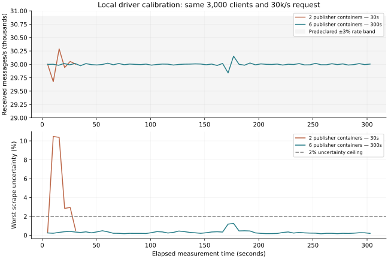

# QoS 1 driver calibration follow-up

Six publisher containers sustained a local 30,000-message/s QoS1 workload for five minutes, with every retained interval meeting the declared rate, lateness, latency and timing-uncertainty checks. This confirms a usable local measurement configuration. It does not establish cloud capacity or scaling across node counts.

## Controlled measurements

Both arms use the same FSS 1.0.17 binary and audit driver image as the previous review. Three isolated broker processes run on the workstation; publishers target the same two brokers in both arms. The shared subscriber population is 10 clients across three containers, one on each broker. There are 3,000 publishers, each sending 10/s, with 216-byte payloads. Each publisher container uses one Erlang scheduler. Full client population is checked before the warmup and measurement interval.

| Measurement | 2 publisher containers | 6 publisher containers |
|---|---:|---:|
| Clients per publisher container | 1,500 | 500 |
| Measurement duration | 30 seconds | 300 seconds |
| Emitted/s | 29,997.6 | 30,000.1 |
| Received/s | 29,999.8 | 30,000.1 |
| Late publications in window | 1.780% | 0% |
| Whole-window p99 upper bound | 50ms | 5ms |
| Maximum individual scrape | 545.1ms | 54.4ms |
| Completed lifetime message identities | 1,368,778 | 9,604,752 |
| Missing / unexpected / unacknowledged / duplicate messages | 0 / 0 / 0 / 0 | 0 / 0 / 0 / 0 |
| Every measurement interval valid | No | **Yes: 60/60** |

The two-container arm passes the whole-window criteria, but four intervals have scrape uncertainty above 2%, and another exceeds the 5% lateness limit. The six-container hold received 29,840–30,153/s in every interval; its worst interval p99 bound was 50ms, worst scrape uncertainty 1.256%, and measured lateness was zero throughout. Lifetime ledger totals include startup and drain; they are not five-minute throughput counts.

A separate 30-second six-container check with the same two-broker placement also reached 30k/s, zero late publications, p99 ≤5ms, and 11.7ms maximum scrape time. An earlier exploratory two-container trial began before full population and is excluded from this comparison. All raw results, including that trial, remain available.



Container parallelism materially affects timing and measurement quality on this machine. More parallelism adds margin without changing per-client pacing or total offer. These are sequential local observations, not randomized independent-host capacity trials; host contention and hardware differences still matter. Removing VM-wide collectors alone was not a demonstrated fix for the cloud run.

## Harness changes

- A calibration schedule can vary publisher containers per site across rungs while holding clients, pacing, payload and subscriber population fixed. Every allocation is validated offline before provisioning, and each rung records its allocation.
- Audited steady gates use conservative per-endpoint timestamp bounds. The old aggregate based on SSH completion time no longer vetoes otherwise-valid endpoint bounds.
- Calibration and capacity reports remain separate. Mixed allocation runs cannot become broker capacity points. Driver qualification requires repeated passing allocations with ≤3% throughput spread, a passing closing control, no incomplete rung, and the same cluster/image/subscriber policy.
- A local stress runner saves immutable image identity, broker binary hash, exact commands, complete metrics, sample timestamps and terminal ledgers. A separate reader recomputes every interval and rejects unstable rate, excessive lateness, latency or scrape uncertainty.

Validation: seven calibration-report tests, the adverse-evidence tests, summary self-tests, and the new shape-validation test passed. Existing steady-gate and canary/rung orchestration tests also passed. The five-minute stress check used the real FSS release and exact message identities, not synthetic fixtures. Local processes and containers were removed afterward.

## Next cloud experiment

`bench/scale/qos1-campaign/calibrate.env` defines one three-broker/five-driver fleet. The load ladder is 30/60/120/120/120/120/120/120/60/30k/s plus a closing control. At 120k, publisher allocations are 2/4/6/6/4/2 per site; subscriber allocation remains two containers per site, and containers are spread across drivers. The same pinned image remains installed throughout. The report selects a configuration only if the larger and smaller allocations have sufficient passing repeats and equivalent throughput.

Only after that calibration passes should the 3/5/7/10-node campaign use the qualified allocation and enough driver capacity. Larger node-count measurements, boundary refinement and long cloud holds remain unexecuted. No additional paid cloud fleet was launched in this follow-up; authorization beyond the previous one-run limit is pending.

## Reproduction and artifacts

Code is on `codex/qos1-harness-proof` in `/home/mfbilling/Work/fss-qos1`.
Raw local evidence is under `/home/mfbilling/.cache/fss-qos1-proof/`:

- `cal-local-two-controlled-20260918/`
- `cal-local-six-two-brokers-20260918/`
- `cal-local-six-soak-20260918/`

The controlled baseline and five-minute hold retain `config.json`, `sample-times.json`, `endpoints.json`, `result.json`, `intervals.json`, per-sample metrics, publisher/subscriber logs and exact identity ledgers.

```sh
python bench/scale/qos1-driver/calibrate-local.py \
  --mqttd /path/to/pinned/mqttd --output NEW_DIRECTORY \
  --containers 6 --publisher-brokers 2 --seconds 300
python bench/scale/qos1-driver/summarize-local.py NEW_DIRECTORY

# No cloud calls:
source bench/scale/qos1-campaign/calibrate.env
PREFLIGHT_ONLY=1 bench/scale/run.sh full 3

# After cloud authorization, use the existing auto-teardown wrapper:
QOS1_PROFILE=/absolute/path/to/calibrate.env \
QOS1_DRIVER_ARCHIVE=/absolute/path/to/verified/driver.tar.gz \
bench/scale/qos1-campaign/run-confirm.sh
python bench/scale/qos1-campaign/calibration-report.py RUN/analysis
```
