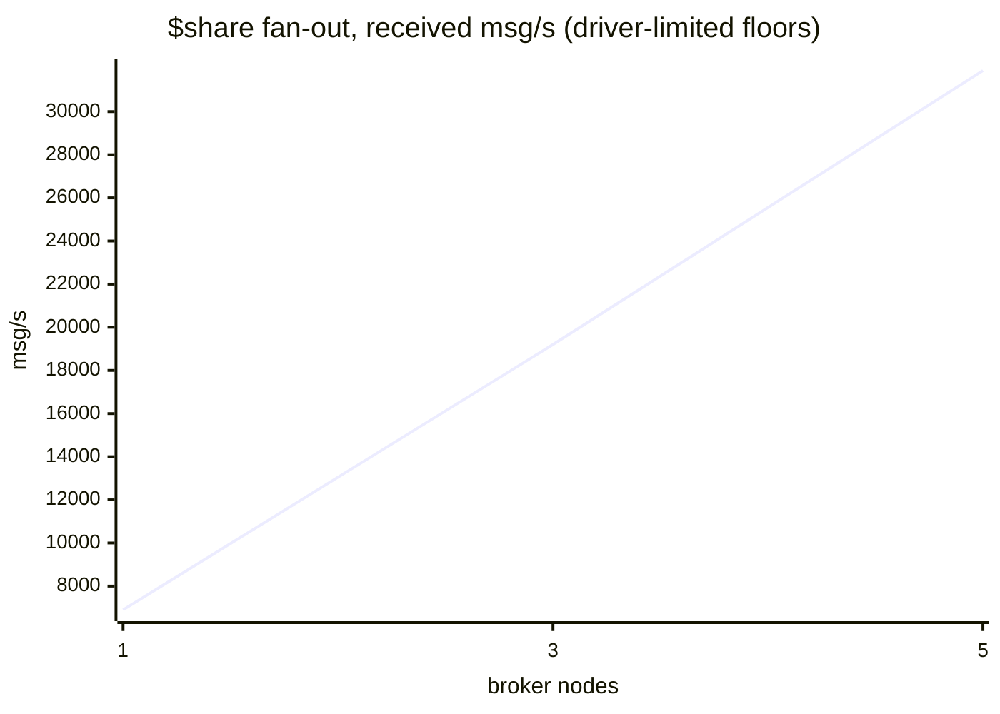

# The scaling curve — throughput and p99 vs node count

**Verified against `v1.0.1` (2026-08-21).** First published run of the ADR 0048
§2 curve: the same workload against fresh 1-, 3- and 5-node clusters of the
signed `v1.0.1` release, one dedicated-vCPU cloud host and one local NVMe disk
per broker, measured by `bench/scale/run.sh` and rendered by
`bench/scale/summarize-curve.py`. **A flat curve is a finding to fix, not a
number to bury** — and this run publishes one measured-then-fixed defect and one
still-open finding beside its numbers.

## Read this first

- **What this is:** mqttd measured against itself at three cluster sizes. No
  competitor appears here — cross-broker comparison is `docs/COMPARISON.md`'s
  job under ADR 0048 §3/§4.
- **Two curves, deliberately** ([ADR 0049](../adr/0049-voter-eligible-durable-ownership.md)):
  the durable QoS 1 curve is fsync- and ownership-bound; the non-durable
  `$share` fan-out curve is routing/CPU-bound. Neither substitutes for the
  other, and the idle-connection point is a third, memory-bound axis.
- **Latency honesty differs by lane.** Lane A percentiles are exact, computed
  from per-message ack RTTs in `crates/mqttd/tests/durable_bench.rs`. Lane B
  percentiles are emqtt-bench histogram **bucket upper bounds** ("p99 ≤ X ms"),
  merged across drivers — coarse, but incapable of flattering.
- **Every fan-out rung was driver-limited** (two 8-core drivers cannot out-offer
  three or five brokers), so Curve 2's numbers are **floors, not capacities** —
  the flag fired on every rung and is reproduced here rather than hidden.

## Host, build, configuration

- **Brokers:** Hetzner Cloud CCX23 (4 dedicated vCPU, AMD EPYC-Milan, 16 GB,
  local NVMe), one broker per host, spread placement group (distinct physical
  machines), `fsn1`, Ubuntu 24.04, kernel 6.8.0-137. Data dir on the host's
  local NVMe — never network storage.
- **Broker build:** the released, cosign-signed, byte-reproducible
  `mqttd-1.0.1-x86_64-unknown-linux-musl`, checksum-verified at install.
  Config: the shipped `deploy/systemd/mqttd.service` + the disclosed drop-in and
  env template in `bench/scale/` (health on 0.0.0.0 for private-net scraping,
  `MQTTD_MAX_CONNECTIONS=60000`, plaintext listener on the private IP,
  durable plane ON for lane A / OFF for lanes B–C, `TOKIO_WORKER_THREADS`
  unset). Cluster PKI from `deploy/systemd/gen-certs.sh`; SWIM signed.
- **Drivers:** 2× CCX33 (8 dedicated vCPU) on the same private network;
  emqtt-bench 0.6.3 (docker, host network) for lanes B–C; `durable_bench`
  built from the release commit for lane A. Driver CPU sampled per rung
  (`mpstat`) — the multi-host substitute for the in-driver driver-bound check,
  which cannot see remote broker CPU and says so in every verdict.
- **Topology per size:** fresh cluster (apply → measure → destroy) — a grown
  cluster is a known-degraded configuration. Founder-first bring-up, founder
  armed to the majority floor before any load. Date: 2026-08-21.

## Per-host durability barrier floors

Measured on every broker host before any lane (`device_barrier_floor`, scratch
on the data-dir filesystem) — the hard per-volume ceiling Curve 1 is judged
against:

| nodes | per-broker floor (single-writer barriers/s) |
|---|---|
| 1 | 2226 |
| 3 | 809 / 779 / 2110 |
| 5 | 2126 / 2296 / 707 / 2225 / 2147 |

The 3.3× spread across "identical" CCX23s (707–2296/s) is multi-tenant NVMe
reality, and it is why these floors are measured per run rather than assumed:
a 3-node quorum write pays the *slowest* member's barrier.

## Curve 1 — durable QoS 1, closed loop (spread ownership)

48 closed-loop publishers × window 8, 48 durable subscribers, 256 B payloads,
sessions round-robin across every node's HRW-owned groups (`MQTTD_BENCH_SPREAD=1`
— production's shape), 60 s measured windows, median [min..max] over 3 reps.
Acks are given only after the message is fsync'd and quorum-replicated
(ADR 0057) — this measures the durability guarantee's price, not raw routing.

| nodes | acked msg/s (saturating) | exact p99 (saturating) | exact p99 (1 publisher, window 1) | verdict |
|---|---|---|---|---|
| 1 | 1951 [1819..2165] | 225 ms [196..231] | **0.82 ms** [0.81..0.89] | valid |
| 3 | 583 [557..627] | 738 ms [725..750] | 9.01 ms [8.62..9.07] | valid |
| 5 | — | — | — | **not measurable — issue #368** (below) |

QoS 2 (exactly-once), same shape: 489 [461..516] msg/s at 1 node,
215 [212..228] at 3. The same load against clean sessions (nothing durable to
write) ran 42k [33k..59k] msg/s at 1 node and 82k [77k..83k] at 3 — the
durable guarantee costs ~20–140× per message on this hardware, and that ratio
IS the product's price tag, stated plainly.

**Reading the 1→3 step honestly:** the drop (1951 → 583) is the quorum tax,
not a regression — at one node an "ack" is a single local fsync near the disk's
2226/s floor (single-copy durability, a *weaker guarantee*, labeled as such);
at three nodes every ack crosses the network twice and waits on the slowest
replica of a set whose measured floors were 779–2110/s. What multi-node durable
buys is **survival of a node's loss with zero acknowledged-message loss**, not
throughput; per ADR 0049 durable ownership capacity scales with the lease-voter
cap (default 5), never with node count.

**The defect this curve found and killed:** on `v1.0.0` the 3-node row was
**0 msg/s** — every publisher stalled ≥10 s, all reps INVALID — and the 5-node
cluster never became measurable. Root cause (issue #358, fixed in `v1.0.1` by
[the peer-link control lane](../adr/0027-replica-group-commit.md)): raft
heartbeats queued behind bulk peer traffic on an unprioritized link FIFO, and
inbound replication requests queued behind hub loops that were transitively
waiting on each other. The fix also roughly **doubled the 1-node durable rate**
(993 → 1951 msg/s) and cut its uncontended p99 from 1.6 ms to 0.82 ms.

## Curve 2 — non-durable `$share` fan-out (the ADR 0015 mechanism)

600 publishers → `bench/%i` (QoS 1, 256 B, window 100), 300 subscribers in one
shared group `$share/g1/bench/#`, both populations spread across both drivers
and all brokers; the same offered ladder (20k…300k msg/s) at every size, 60 s
per rung. Latency = merged histogram bucket bounds. Broker restarted clean per
size, durable plane off (disclosed posture parity with `bench/`).

| nodes | aggregate received (best rung) | p99 bound | vs 1 node |
|---|---|---|---|
| 1 | ~6.9k msg/s | ≤ 100–500 ms | — |
| 3 | ~19.2k msg/s | ≤ 100 ms | 2.8× |
| 5 | ~31.9k msg/s | **≤ 25 ms** | 4.6× |



Near-linear scaling with the tail *tightening* as nodes are added (the p99
bound fell 100→25 ms from 1 to 5 nodes) — the ADR 0015 shared-subscription
mechanism distributing load exactly as claimed. **Every rung was
driver-limited**: two drivers saturated before any cluster size did, so these
are floors and no knee exists in this data. Finding the 5-node knee needs a
driver fleet comparable to the broker fleet — itself a statement about the
broker's headroom. Driver-sent vs broker-received counters disagree by ~10–50%
on every rung because a stopped publisher container's last printed total lags
its true count; the broker-side counter is authoritative and the summarizer
flags every such row rather than reconciling silently.

An mTLS reference rung (50k offered) ran per size in the same shape; its raw
results are in the run directory and are not yet summarized to a table.

## Connections at 50,000

emqtt-bench `conn`, 50,000 total connections ramped at 2,500/s and held 120 s,
spread across all brokers:

| nodes | connected | broker RSS growth | KiB per idle connection |
|---|---|---|---|
| 1 | 50,000 | 944 MiB | 19.3 |
| 3 | 50,000 | 943 MiB | 19.3 |
| 5 | 50,000 | 941 MiB | 19.3 |

Per-connection memory is flat in cluster size to three significant figures —
connection capacity is a per-node RAM/fd question, exactly as `docs/SIZING.md`
models it (~15 KiB/conn claimed; 19.3 measured with the observability stack
running).

## Losing dimensions, stated first

- **Durable throughput does not scale with node count — it pays for it.** The
  1→3 step *costs* ~70% of single-node durable throughput (quorum round-trips +
  slowest-disk coupling), and durable *ownership* capacity is bounded by the
  lease-voter cap (`MQTTD_LEASE_VOTERS`, default 5; ADR 0021/0049): 1/3/5 is
  the entire uncapped regime, and adding a sixth node adds no durable capacity.
- **The 5-node durable point could not be measured** (issue #368, open): on
  both runs, minutes after clean formation, four nodes evicted the fifth from
  their membership view while it fell out of the lease group; the harness
  refused to measure through the degraded state. The earlier published
  "replica_groups plateaus at 75–85% on 5 nodes" (0048-T5) was likely this
  mechanism's milder face.
- **Curve 2's numbers are floors** — every rung driver-limited; no knee was
  found at any size.
- **One durable append still costs ~one disk barrier** on the owner path (no
  owner-side group commit — the known lever for raising Curve 1's ceiling,
  ADR 0027's remaining half).
- Lane B p99s are bucket bounds; cross-driver clock skew bounds the finest
  readable bucket.
- Multi-tenant NVMe variance (3.3× across nominally identical hosts) is real
  and measured per run; two runs of this curve may legitimately differ.

## A run judges itself

Enforced mechanically, not by authorial discipline: per-host barrier probes
gate Curve 1 (a size without probes renders UNINTERPRETABLE);
`durable_bench`'s own verdicts (violations/caveats) are carried verbatim,
including that the in-driver driver-bound check cannot run multi-host; broker
counter deltas cross-check driver totals with every mismatch flagged;
driver-limited rungs are excluded from knee detection; preflight captures every
node's `/readyz` + `/statusz` — which is how issue #368 was caught rather than
averaged over.

## Reproducing everything above

```sh
cd bench/scale
export HCLOUD_TOKEN=...   # Read & Write token, dedicated Hetzner project
./run.sh smoke            # ~20 min, <€0.50 — proves the rig end to end
MQTTD_VERSION=1.0.1 OBSERVE=1 ./run.sh full   # the curve, ~€2, ~4 h
python3 summarize-curve.py .runs/<stamp>/results
```

The rig: `bench/scale/run.sh` (orchestration), `bench/scale/terraform/`
(hosts), `bench/scale/bootstrap-cluster.sh` (secrets + founder-first bring-up),
`bench/scale/run-curve.sh` (lanes), `bench/scale/observe.sh` (live Grafana) —
see `bench/scale/README.md`.

## Related

- `docs/benchmarks/DURABLE-PATH.md` — the single-host durable floor this curve
  extends to real hosts, and the method the closed-loop lane inherits.
- `docs/adr/0048-comparative-benchmarking.md` §2 — the mandate and honesty
  rules; `docs/delivery/0048-comparative-benchmarking.md` T3/T4 track this work.
- Issues: #358 (fixed in v1.0.1 — measured before and after here), #368 (open —
  the 5-node durable formation instability this run isolated).
