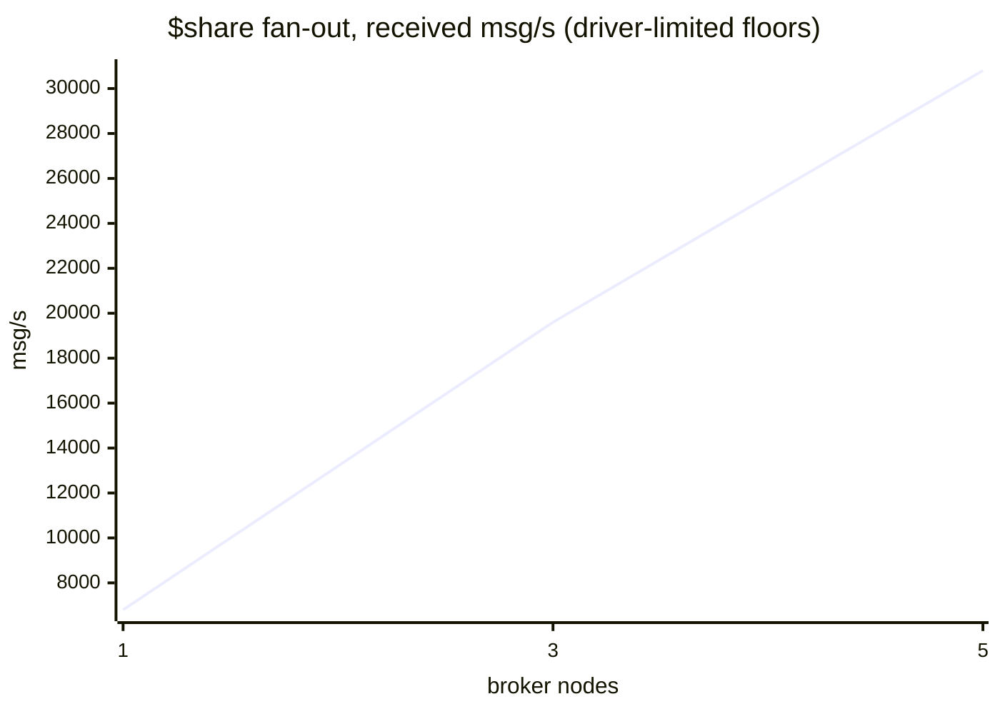

# The scaling curve — throughput and p99 vs node count

**Verified against `v1.0.2` (2026-08-21).** Second published run of the ADR 0048
§2 curve: the same workload against fresh 1-, 3- and 5-node clusters of the
signed `v1.0.2` release, one dedicated-vCPU cloud host and one local NVMe disk
per broker, measured by `bench/scale/run.sh` and rendered by
`bench/scale/summarize-curve.py`. This run measures two features shipped since
the `v1.0.1` curve — **owner-side group commit** (ADR 0071) and **per-message
durability tiers** (ADR 0072) — and, per the standing rule that **a flat curve
is a finding to fix, not a number to bury**, it also republishes the one point
that remains unmeasurable and why.

## Read this first

- **What this is:** mqttd measured against itself at three cluster sizes. No
  competitor appears here — cross-broker comparison is `docs/COMPARISON.md`'s
  job under ADR 0048 §3/§4.
- **Two curves, deliberately** ([ADR 0049](../adr/0049-voter-eligible-durable-ownership.md)):
  the durable QoS 1 curve is fsync- and ownership-bound; the non-durable
  `$share` fan-out curve is routing/CPU-bound. Neither substitutes for the
  other, and the idle-connection point is a third, memory-bound axis.
- **Latency honesty differs by lane.** Lane A percentiles are exact, computed
  from per-message ack RTTs in `crates/mqttd/tests/durable_bench.rs`. Lane B
  percentiles are emqtt-bench histogram **bucket upper bounds** ("p99 ≤ X ms"),
  merged across drivers — coarse, but incapable of flattering.
- **Every fan-out rung was driver-limited** (two 8-core drivers cannot out-offer
  three or five brokers), so Curve 2's numbers are **floors, not capacities** —
  the flag fired on every rung and is reproduced here rather than hidden.

## Host, build, configuration

- **Brokers:** Hetzner Cloud CCX23 (4 dedicated vCPU, AMD EPYC-Milan, 16 GB,
  local NVMe), one broker per host, spread placement group (distinct physical
  machines), `fsn1`, Ubuntu 24.04, kernel 6.8.0-137. Data dir on the host's
  local NVMe — never network storage.
- **Broker build:** the released, cosign-signed, byte-reproducible
  `mqttd-1.0.2-x86_64-unknown-linux-musl`, checksum-verified at install.
  Config: the shipped `deploy/systemd/mqttd.service` + the disclosed drop-in and
  env template in `bench/scale/` (health on 0.0.0.0 for private-net scraping,
  `MQTTD_MAX_CONNECTIONS=60000`, plaintext listener on the private IP,
  durable plane ON for lane A / OFF for lanes B–C, `TOKIO_WORKER_THREADS`
  unset, and — new this run, disclosed in the template —
  `MQTTD_ALLOW_RELAXED_PUBLISH=1` so the ADR 0072 tier lanes can run; default
  lanes publish v3.1.1 with no property and are unaffected). Cluster PKI from
  `deploy/systemd/gen-certs.sh`; SWIM signed.
- **Drivers:** 2× CCX33 (8 dedicated vCPU) on the same private network;
  emqtt-bench 0.6.3 (docker, host network) for lanes B–C; `durable_bench`
  built from the release commit for lane A. Driver CPU sampled per rung
  (`mpstat`) — the multi-host substitute for the in-driver driver-bound check,
  which cannot see remote broker CPU and says so in every verdict.
- **Topology per size:** fresh cluster (apply → measure → destroy) — a grown
  cluster is a known-degraded configuration. Founder-first bring-up, founder
  armed to the majority floor before any load. Date: 2026-08-21.

## Per-host durability barrier floors

Measured on every broker host before any lane (`device_barrier_floor`, scratch
on the data-dir filesystem) — the per-volume ceiling a **one-fsync-per-append**
design would be judged against:

| nodes | per-broker floor (single-writer barriers/s) |
|---|---|
| 1 | 2072 |
| 3 | 2196 / 2383 / 2168 |
| 5 | 2072 / 2071 / 730 / 1927 / 2252 |

Multi-tenant NVMe variance is real (this run drew a 3.0× spread at 5 nodes,
730–2252/s; the previous run drew 3.3×), and it is why these floors are
measured per run rather than assumed. Since ADR 0071, though, the floor is no
longer the append ceiling — see the batching evidence below.

## Curve 1 — durable QoS 1, closed loop (spread ownership)

48 closed-loop publishers × window 8, 48 durable subscribers, 256 B payloads,
sessions round-robin across every node's HRW-owned groups (`MQTTD_BENCH_SPREAD=1`
— production's shape), 60 s measured windows, median [min..max] over 3 reps.
Acks are given only after the message is fsync'd and quorum-replicated
(ADR 0057) — this measures the durability guarantee's price, not raw routing.

| nodes | acked msg/s (saturating) | exact p99 (saturating) | exact p99 (uncontended: window 1, one publisher per node) | verdict |
|---|---|---|---|---|
| 1 | 2791 [2720..3028] | 153 ms [143..160] | 0.98 ms [0.97..0.99] | valid |
| 3 | 1753 [1731..1860] | 239 ms [237..244] | 3.63 ms [3.56..3.75] | valid |
| 5 | — | — | — | **not measurable — issue #368** (below) |

QoS 2 (exactly-once), same shape: 1633 [1627..1683] msg/s at 1 node,
1112 [1097..1178] at 3. The same load against clean sessions (nothing durable
to write) ran 39k [31k..54k] msg/s at 1 node and 79k [77k..82k] at 3 — the
durable guarantee now costs ~14–45× per message on this hardware (down from
~20–140× on `v1.0.1`), and that ratio IS the product's price tag, stated
plainly.

**What group commit changed (ADR 0071), previous curve → this curve, same rig
and method:**

| point | v1.0.1 | v1.0.2 | change |
|---|---|---|---|
| 1-node QoS 1 durable | 1951 msg/s | 2791 msg/s | **+43%** |
| 3-node QoS 1 durable | 583 msg/s | 1753 msg/s | **3.0×** |
| 1-node QoS 2 durable | 489 msg/s | 1633 msg/s | **3.3×** |
| 3-node QoS 2 durable | 215 msg/s | 1112 msg/s | **5.2×** |
| 3-node QoS 1 sat p99 | 738 ms | 239 ms | −68% |
| 3-node uncontended p99 | 9.0 ms | 3.6 ms | −60% |

Two pieces of direct evidence that the mechanism, not host luck, produced
this:

- **The 1-node rate exceeds its own disk's barrier floor** — 2791 acked
  appends/s on a volume that sustains 2072 single-writer barriers/s. That is
  only possible if multiple appends share one fsync.
- **The writer's own counters** (`mqttd_durable_writer_*`, polled from the
  brokers during the 3-node saturating window): 2,658,532 durable ops rode
  873,099 fsync'd batches — **3.05 ops per barrier on average, 41 at peak** —
  across owner appends and follower replica-applies sharing the same
  serializer (the ADR 0071 design point).

**Reading the 1→3 step honestly:** the drop (2791 → 1753) is the quorum tax,
not a regression — every 3-node ack crosses the network twice and waits on the
slowest replica of the quorum. The tax is much smaller than it was (37% vs 70%
of single-node throughput lost), because group commit lets concurrent appends
share the slowest disk's barriers instead of queuing behind each other's. What
multi-node durable buys is **survival of a node's loss with zero
acknowledged-message loss**, not throughput; per ADR 0049 durable ownership
capacity scales with the lease-voter cap (default 5), never with node count.

**The defect the first curve found and killed** (kept for the record): on
`v1.0.0` the 3-node row was **0 msg/s** — every publisher stalled ≥10 s. Root
cause (issue #358, fixed in `v1.0.1`): raft heartbeats queued behind bulk peer
traffic on an unprioritized link FIFO. `v1.0.1` measured the fix; this curve
measures ADR 0071 on top of it.

## Durability tiers (ADR 0072) — same workload, publisher-selected ack meaning

New in `v1.0.2`: an MQTT 5 publisher may ask, per message, what its ack means
via the `mqttd-durability` user property — `quorum` (the default: fsync'd on a
majority, cluster-wide), `local` (fsync'd on the owner, single copy), or
`relaxed` (accepted and submitted; writes proceed detached). Honored only
under the operator opt-in, which this rig enables and discloses. The same lane
A shape ran once per tier, plus a low-contention variant (window 1) per tier,
because a closed loop at saturation flow-controls **every** tier to the durable
pipeline's completion rate — at saturation the tier changes what the ack
*means*, not how fast acks *come*; the tier's real face is the uncontended ack
RTT.

| nodes | tier | acked msg/s (sat) | exact p99 (sat) | exact p99 (uncontended) |
|---|---|---|---|---|
| 1 | `quorum` | 2791 [2720..3028] | 153 ms | 0.98 ms |
| 1 | `local` | 2583 [2537..2587] | 167 ms | — † |
| 1 | `relaxed` | 2153 [2132..2170] | 198 ms | — † |
| 3 | `quorum` | 1753 [1731..1860] | 239 ms | 3.63 ms [3.56..3.75] |
| 3 | `local` | 1712 [1709..1716] | 245 ms | 3.50 ms [3.41..3.55] |
| 3 | `relaxed` | 1604 [1587..1619] | 264 ms | 5.28 ms [4.93..5.39] |

† the uncontended tier variant was added to the rig after the 1-node point had
already run; only the 3-node point has it. (At 1 node `local` and `quorum` are
the same contract anyway — a majority of one IS the owner's fsync.)

**The finding is convergence, and it is in the tiers' favor being boring
here:** on datacenter NVMe with sub-millisecond LAN RTTs and group commit
underneath, a full quorum ack costs ~3.6 ms p99 uncontended — so weakening the
guarantee buys nothing (`local` saves ~0.1 ms; `relaxed`'s tail is *wider*
because its acks decouple from the pipeline's pacing, and at saturation the
weaker tiers even measure slightly lower since detached writes still consume
the same pipeline while the closed loop stops pacing publishers to it). The
tiers earn their keep where the strict path is expensive: slow or
barrier-costly storage and high-RTT topologies. Measured on a macOS dev
machine (F_FULLFSYNC ≈ 10 ms/barrier) during ADR 0072's delivery: `relaxed`
acked ~16,700 msg/s at p50 0.05 ms where `quorum` acked 56/s at p50 ~18 ms —
a 300× gap on hardware where durability is dear, versus parity on hardware
where it is cheap. Publisher rails (min-replicas write floor, brownout
refusals) gate every tier identically; `relaxed` is not a bypass.

## Curve 2 — non-durable `$share` fan-out (the ADR 0015 mechanism)

600 publishers → `bench/%i` (QoS 1, 256 B, window 100), 300 subscribers in one
shared group `$share/g1/bench/#`, both populations spread across both drivers
and all brokers; the same offered ladder (20k…300k msg/s) at every size, 60 s
per rung. Latency = merged histogram bucket bounds. Broker restarted clean per
size, durable plane off (disclosed posture parity with `bench/`).

| nodes | aggregate received (best rung) | p99 bound | vs 1 node |
|---|---|---|---|
| 1 | ~6.8k msg/s | ≤ 100 ms | — |
| 3 | ~19.6k msg/s | ≤ 50 ms | 2.9× |
| 5 | ~30.8k msg/s | **≤ 25 ms** | 4.5× |



Near-linear scaling with the tail *tightening* as nodes are added (the p99
bound fell 100→25 ms from 1 to 5 nodes) — the ADR 0015 shared-subscription
mechanism distributing load exactly as claimed, and consistent with the
`v1.0.1` run to within a few percent (this lane is untouched by 0071/0072, as
it should be). **Every rung was driver-limited**: two drivers saturated before
any cluster size did, so these are floors and no knee exists in this data.
Driver-sent vs broker-received counters disagree by ~10–50% on every rung
because a stopped publisher container's last printed total lags its true
count; the broker-side counter is authoritative and the summarizer flags every
such row rather than reconciling silently.

An mTLS reference rung (50k offered) ran per size in the same shape; its raw
results are in the run directory and are not yet summarized to a table.

## Connections at 50,000

emqtt-bench `conn`, 50,000 total connections ramped at 2,500/s and held 120 s,
spread across all brokers:

| nodes | connected | broker RSS growth | KiB per idle connection |
|---|---|---|---|
| 1 | 50,000 | 944 MiB | 19.3 |
| 3 | 50,000 | 942 MiB | 19.3 |
| 5 | 50,000 | 944 MiB | 19.3 |

Per-connection memory is flat in cluster size to three significant figures —
identical to the `v1.0.1` run — connection capacity is a per-node RAM/fd
question, exactly as `docs/SIZING.md` models it (~15 KiB/conn claimed; 19.3
measured with the observability stack running).

## Losing dimensions, stated first

- **Durable throughput still does not scale with node count — it pays for
  it.** Group commit shrank the 1→3 tax from ~70% to ~37%, but the sign is
  unchanged, and durable *ownership* capacity is bounded by the lease-voter
  cap (`MQTTD_LEASE_VOTERS`, default 5; ADR 0021/0049): 1/3/5 is the entire
  uncapped regime, and adding a sixth node adds no durable capacity.
- **The 5-node durable point is still not measurable** (issue #368, open —
  second curve in a row). This run adds evidence: after clean formation
  (founder armed, all five ready), four nodes evicted the fifth from their
  membership view while that node still saw five members and lost lease-group
  readiness — an asymmetric SWIM split that persisted for the whole lane, so
  the harness refused to measure through it, every rep. (A first provisioning
  attempt also failed *before* the broker ever ran — Hetzner's private-network
  NIC never appeared on one host — recorded separately in the run dir; that
  one is infrastructure, not mqttd.) Non-durable lanes B/C measured normally
  on the degraded-formation-free second cluster.
- **On fast hardware the durability tiers buy ~nothing** — see the tier
  section; the honest summary is "quorum is already cheap here", and the tiers'
  value is confined to slow-barrier or high-RTT deployments.
- **Curve 2's numbers are floors** — every rung driver-limited; no knee was
  found at any size.
- Lane B p99s are bucket bounds; cross-driver clock skew bounds the finest
  readable bucket.
- Multi-tenant NVMe variance (3.0× across nominally identical hosts this run)
  is real and measured per run; two runs of this curve may legitimately differ.
- The subscriber-side ack path still crosses the hub loop for its store
  truncate (ADR 0061's named residual); quantified during 0071's delivery as
  the next single-host lever, it is invisible at these cloud floors but
  dominates on high-barrier-cost hosts.

## A run judges itself

Enforced mechanically, not by authorial discipline: per-host barrier probes
gate Curve 1 (a size without probes renders UNINTERPRETABLE);
`durable_bench`'s own verdicts (violations/caveats) are carried verbatim,
including that the in-driver driver-bound check cannot run multi-host; broker
counter deltas cross-check driver totals with every mismatch flagged;
driver-limited rungs are excluded from knee detection; preflight captures every
node's `/readyz` + `/statusz` — which is how issue #368 was caught (twice)
rather than averaged over.

## Reproducing everything above

```sh
cd bench/scale
export HCLOUD_TOKEN=...   # Read & Write token, dedicated Hetzner project
./run.sh smoke            # ~20 min, <€0.50 — proves the rig end to end
MQTTD_VERSION=1.0.2 OBSERVE=1 ./run.sh full   # the curve, ~€2, ~4 h
python3 summarize-curve.py .runs/<stamp>/results
```

The rig: `bench/scale/run.sh` (orchestration), `bench/scale/terraform/`
(hosts), `bench/scale/bootstrap-cluster.sh` (secrets + founder-first bring-up),
`bench/scale/run-curve.sh` (lanes, including the per-tier saturating and
uncontended variants), `bench/scale/observe.sh` (live Grafana) — see
`bench/scale/README.md`.

## Related

- `docs/benchmarks/DURABLE-PATH.md` — the single-host durable floor this curve
  extends to real hosts, and the method the closed-loop lane inherits.
- `docs/adr/0071-owner-side-group-commit.md` — the batching this curve
  measures; `docs/adr/0072-per-message-durability-selection.md` — the tiers.
- `docs/adr/0048-comparative-benchmarking.md` §2 — the mandate and honesty
  rules; `docs/delivery/0048-comparative-benchmarking.md` T3/T4 track this work.
- Issues: #358 (fixed in v1.0.1 — measured then), #368 (open — the 5-node
  durable formation instability, reproduced by both published curves).
